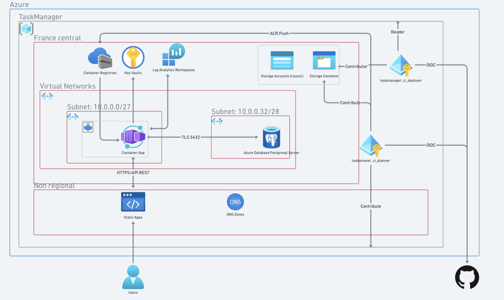

# TaskManager — Portfolio Cloud & DevOps sur Azure

Projet volontairement minimaliste de gestion de tâches. L’objectif principal n’est pas l’application elle-même, mais la mise en pratique de compétences Cloud, DevOps et Infrastructure as Code.

L’application permet d’ajouter et de supprimer des tâches.

> **Disclaimer —** Le frontend, le backend et la base de données servent de support à l’infrastructure ; ils ont été générés avec l’aide d’IA. La documentation a également été produite avec l’aide d’IA et relue sous contrôle humain.

## Sommaire

- [Objectifs](#objectifs)
- [Architecture cible](#architecture-cible)
- [Architecture et choix de conception](#architecture-et-choix-de-conception)
- [Stack technique](#stack-technique)
- [Prérequis et démarrage](#prérequis-et-démarrage)
- [Terraform](#terraform)
- [Branches](#branches)
- [CI/CD](#cicd)
- [Authentification PostgreSQL et Entra ID](#authentification-postgresql-et-entra-id)
- [Sécurité](#sécurité)

## Objectifs

- Provisionner une infrastructure Azure avec Terraform.
- Séparer le bootstrap de sécurité de l’infrastructure applicative.
- Utiliser GitHub Actions pour la CI/CD.
- Authentifier GitHub auprès d’Azure avec OIDC, sans secret Azure longue durée.
- Appliquer le principe du moindre privilège avec Azure RBAC.
- Conteneuriser et valider le backend avant publication.
- Protéger `main` : une modification ne doit être mergée qu’après validation des checks CI.

## Architecture cible

```text
Utilisateur
    │
    ├── Azure Static Web Apps
    │       └── Frontend React
    │
    └── Azure Container Apps
            └── API NestJS
                    │
                    ├── Azure Database for PostgreSQL Flexible Server
                    └── Identité managée runtime

Bootstrap Terraform
    ├── Azure Container Registry
    ├── Azure Storage Account
    │       └── Terraform remote state
    ├── Identités managées CI et fédérations GitHub OIDC
    └── Groupes de sécurité Entra ID PostgreSQL
```

L’infrastructure réseau cible utilise un VNet dédié, un subnet pour Azure Container Apps, un subnet délégué à PostgreSQL et une zone DNS privée PostgreSQL.

## Architecture et choix de conception



> **Note —** Ce diagramme est maintenu avec Whimsical. En raison des limites du plan gratuit, sa mise à jour peut être différée. La configuration Terraform est la référence pour l’état réel de l’infrastructure.

Ce schéma documente les choix d’architecture mis en œuvre et les responsabilités de chaque composant :

- **Périmètre régional** : les composants applicatifs et réseau sont regroupés en `France Central`. La zone DNS privée est une ressource globale liée au VNet. Azure Static Web Apps diffuse les fichiers statiques globalement, même si la ressource nécessite une localisation Azure prise en charge lors de sa création.
- **Réseau** : la Container App est intégrée au subnet `10.0.0.0/27`. PostgreSQL se trouve dans le subnet délégué `10.0.0.32/28`, sans accès public. L’API joint la base par son nom DNS privé via TCP `5432` chiffré avec TLS.
- **Séparation des identités** : `taskmanager-ci-planner` produit les plans ; `taskmanager-ci-deployer` déploie depuis `main`, pousse l’image vers ACR et accède au state Blob dans les limites de ses rôles RBAC. L’identité `acr_pull_container_app` est dédiée à la récupération de l’image ACR par la Container App ; elle est distincte des identités CI.
- **CI/CD sans secret longue durée** : GitHub échange un jeton OIDC contre une identité Entra fédérée. Les permissions Azure, notamment `Reader`, `Contributor`, `AcrPush` et `Storage Blob Data Contributor`, sont accordées séparément et au périmètre le plus restreint utile.
- **PostgreSQL et Entra ID** : l’authentification par mot de passe est désactivée. Le groupe `PG admin group`, créé au bootstrap, est l’administrateur Entra du serveur PostgreSQL. Le groupe `PG TaskManager Members` réunit l’utilisateur humain et l’identité managée `bdd_user`, prévue pour les futures migrations et accès applicatifs.
- **Observabilité** : Log Analytics centralise les logs de la plateforme. Key Vault n’est pas déployé actuellement : il sera ajouté uniquement lorsqu’un secret applicatif le justifiera.

## Stack technique

| Domaine | Technologies |
|---|---|
| Frontend | React |
| Backend | NestJS |
| Base de données | PostgreSQL Flexible Server |
| ORM | Prisma |
| Conteneurisation | Docker / Docker Compose |
| Gestion de code | Git / GitHub |
| CI/CD | GitHub Actions |
| Infrastructure as Code | Terraform |
| Cloud | Microsoft Azure |

<p align="center">
  
  
  
  
  
  
  
  
  
</p>

## Prérequis et démarrage

### Outils du poste

| Outil | Usage dans le projet | Requis |
|---|---|---|
| Git | Cloner le dépôt, créer des branches et pousser le code | Oui |
| Node.js 20 LTS et npm | Installer et exécuter les builds/tests React, NestJS et Prisma | Oui |
| Docker Desktop avec Docker Compose | Construire l’image du backend et lancer la base PostgreSQL locale | Oui pour Docker / le développement local complet |
| Terraform | Provisionner et vérifier l’infrastructure Azure | Oui pour l’infrastructure |
| Azure CLI (`az`) | Connexion Entra ID locale et enregistrement des Resource Providers | Oui pour le bootstrap et le diagnostic local |
| `act` | Rejouer localement certains jobs GitHub Actions | Optionnel |

NestJS, React, Vite, Prisma et TypeScript sont installés comme dépendances du projet avec `npm ci` : aucune installation globale de ces frameworks n’est nécessaire.

### Accès nécessaires

- Un compte GitHub et un dépôt où GitHub Actions est activé.
- Une souscription Azure et un compte Entra ID autorisé à créer les ressources du bootstrap.
- Pour créer les attributions RBAC, le compte qui exécute le bootstrap doit disposer des droits de gestion d’accès au périmètre concerné (par exemple `Owner` ou `User Access Administrator`), en plus des droits de création de ressources.
- Le bootstrap gère aussi des groupes de sécurité Entra ID ; le compte humain qui l’exécute doit donc être autorisé à les créer et les administrer dans le tenant.
- Les trois identifiants non secrets de l’identité CI (`client ID`, `tenant ID`, `subscription ID`) sont configurés dans les secrets GitHub. Aucun `client secret` Azure ni clé de Storage Account ne doit être ajouté à GitHub.

### Resource Providers Azure à enregistrer

L’enregistrement s’effectue au niveau de la souscription. Il peut être fait une fois avant le premier déploiement :

```bash
az provider register --namespace <namespace>
```

| Namespace | Utilisé pour |
|---|---|
| `Microsoft.App` | Azure Container Apps et Container Apps Environment |
| `Microsoft.ContainerRegistry` | Azure Container Registry |
| `Microsoft.DBforPostgreSQL` | PostgreSQL Flexible Server |
| `Microsoft.ManagedIdentity` | User Assigned Managed Identities et fédération GitHub OIDC |
| `Microsoft.Network` | VNet, subnets, délégation PostgreSQL et liens DNS privés |
| `Microsoft.OperationalInsights` | Log Analytics Workspace |
| `Microsoft.Storage` | Storage Account et conteneur Blob du state Terraform |
| `Microsoft.Web` | Azure Static Web Apps |

> Un nom mal orthographié, par exemple `Microsft.Network`, ne peut pas être enregistré. `Microsoft.App` est important : il correspond au service Azure Container Apps.

### Parcours recommandé : du clonage au déploiement

1. Cloner le dépôt et installer les dépendances applicatives avec `npm ci` dans `backend/` puis dans `frontend/`.
2. Vérifier localement le backend (`npm run build`, `npm test`) et le frontend (`npm run build`). Pour une base locale, Docker Compose démarre PostgreSQL ; les valeurs de développement restent locales et ne doivent jamais devenir des secrets de production.
3. Installer Docker Desktop, Terraform et Azure CLI, puis se connecter localement avec `az login`.
4. Mettre à jour `terraform/bootstrap/variables.tf` avec les sujets OIDC du dépôt GitHub cible : un sujet `pull_request` pour l’identité de planification et un sujet `ref:refs/heads/main` pour l’identité de déploiement.
5. Enregistrer les Resource Providers listés ci-dessus, puis exécuter une première fois le bootstrap Terraform avec un state local (`terraform init -backend=false`, puis `terraform apply`) et un compte humain autorisé. Il crée le Storage Account de state, l’ACR, les identités managées, les fédérations OIDC, le RBAC et les groupes Entra ID PostgreSQL.
6. Relever le nom du Storage Account créé. Le renseigner, avec le tenant Azure cible, dans `terraform/bootstrap/backend.tf`, puis relancer l’initialisation du bootstrap pour migrer son state local vers Azure Blob :

   ```bash
   terraform init -migrate-state
   ```

   Terraform demande confirmation avant de copier le state local dans le container Blob `tfstate`.
7. Reporter ensuite ce même nom de Storage Account dans `terraform/prod/backend.tf` et comme valeur par défaut de la variable `state_storage` dans `terraform/prod/variables.tf`, puis initialiser `terraform/prod` avec ce backend distant :

   ```hcl
   variable "state_storage" {
     type    = string
     default = "<nom-du-storage-account-créé-par-le-bootstrap>"
   }
   ```

   Cette valeur est le nom du Storage Account, pas une clé d’accès : elle n’est pas secrète. Elle est nécessaire pour que l’état `prod` puisse lire les outputs du bootstrap et utiliser le backend Azure Blob.
8. Configurer les secrets GitHub nécessaires à l’authentification OIDC et pousser les changements sur `dev`. Les builds/tests s’exécutent, puis une Pull Request vers `main` produit un plan Terraform.
9. Après les checks et le merge vers `main`, le workflow Terraform applique le plan exact avec l’identité CI de déploiement. Le workflow applicatif construit l’image du backend, la pousse dans ACR et met à jour la Container App.

## Terraform

Le projet sépare volontairement deux états Terraform :

```text
terraform/
├── bootstrap/   # Fondations : state, ACR, identités, RBAC et groupes Entra
└── prod/        # Infrastructure applicative Azure
```

### Bootstrap

Le bootstrap crée notamment :

- le Resource Group `TaskManager` ;
- l’Azure Container Registry ;
- les fédérations OIDC GitHub ;
- le Storage Account et le container Blob privé `tfstate` ;
- les groupes de sécurité Entra ID `PG admin group` et `PG TaskManager Members`.

#### Identités managées et droits Azure

| Identité | Usage | Droits actuellement attribués |
|---|---|---|
| `taskmanager-ci-planner` | Plan Terraform sur Pull Request, via OIDC GitHub | `Reader` sur le Resource Group ; `Storage Blob Data Contributor` sur le container `tfstate` ; rôle personnalisé `Terraform Planner Secret Reader` permettant uniquement de lire les secrets de Container Apps et les secrets/app settings de Static Web Apps nécessaires au rafraîchissement du plan. |
| `taskmanager-ci-deployer` | Apply Terraform et déploiement applicatif après un push sur `main`, via OIDC GitHub | `Contributor` sur le Resource Group ; `Storage Blob Data Contributor` sur le container `tfstate` ; `AcrPush` sur l’Azure Container Registry. |
| `acr_pull_container_app` | Identité runtime affectée à la Container App | `AcrPull` sur l’Azure Container Registry, uniquement pour récupérer l’image du backend. |
| `bdd_user` | Identité réservée aux futures migrations et aux accès PostgreSQL applicatifs | Aucun rôle Azure RBAC n’est attribué actuellement. Elle est membre du groupe Entra `PG TaskManager Members`, mais ce groupe ne dispose pas encore de privilèges SQL dans PostgreSQL. |

Le groupe `PG admin group` contient le compte humain administrateur et est configuré comme administrateur Entra du serveur PostgreSQL. Il ne s’agit pas d’une identité managée.

Les outputs du bootstrap exposent notamment le login server ACR, l’identité runtime et les informations des groupes Entra consommés par l’état `prod` via `terraform_remote_state`.

### Paramétrage pour un nouvel environnement

Les constantes du projet, telles que le nom `TaskManager`, les noms des identités, les groupes Entra, les plages réseau ou les régions, restent versionnées dans Terraform. Elles ne doivent pas être transformées en variables propres à chaque développeur.

Pour déployer le projet dans un autre tenant Azure ou depuis un autre dépôt GitHub, seules les configurations suivantes doivent être adaptées :

1. Dans `terraform/bootstrap/variables.tf`, renseigner les sujets OIDC correspondant au dépôt GitHub cible :
   - `repo:<organisation-ou-utilisateur>/<dépôt>:pull_request` pour l’identité de planification ;
   - `repo:<organisation-ou-utilisateur>/<dépôt>:ref:refs/heads/main` pour l’identité de déploiement.
2. Dans `terraform/bootstrap/backend.tf`, renseigner le tenant Azure cible et le Storage Account contenant le state du bootstrap.
3. Après l’exécution du bootstrap, reporter le nom du Storage Account créé dans les deux fichiers de production :
   - `terraform/prod/backend.tf`, pour le state de production ;
   - `terraform/prod/variables.tf`, pour permettre à `terraform_remote_state` de lire les outputs du bootstrap.

Le backend Terraform ne peut pas utiliser une variable Terraform. Le Storage Account doit donc être renseigné séparément dans `backend.tf` et dans `state_storage`, avec la même valeur.

Les paramètres GitHub restent configurés hors du dépôt : les identifiants Azure dans les secrets GitHub, ainsi que `PR_AUTOMATION_APP_ID` (variable GitHub) et `PR_AUTOMATION_APP_PRIVATE_KEY` (secret GitHub). Aucune de ces valeurs ne doit être écrite dans Terraform versionné.

Le state Terraform est sensible. Les fichiers suivants ne doivent jamais être commités :

```text
terraform.tfstate
terraform.tfstate.backup
.terraform/
```

Les fichiers `.terraform.lock.hcl` doivent en revanche être versionnés.

### Infrastructure de production

Le dossier `terraform/prod` référence le Resource Group créé par le bootstrap avec une source de données Terraform. Il ne recrée pas ce Resource Group.

L’infrastructure déclarée comprend notamment :

- Virtual Network et subnets ;
- Log Analytics ;
- Azure Container Apps Environment et Container App ;
- Azure Static Web App ;
- PostgreSQL Flexible Server privé avec authentification Entra ID ;
- zone DNS privée PostgreSQL.

Le registre, les identités et les accès de fondation restent dans le state `bootstrap`. L’infrastructure de production les consomme sans les recréer.

## Branches

```text
dev
 └── CI : tests, builds, image Docker
        │
        └── Pull Request vers main
                        └── Terraform plan
                                └── Merge après checks réussis
                                ├── Terraform apply de production
                                └── Build, push ACR et mise à jour du backend
```

## CI/CD

### CI sur `dev`

À chaque push sur `dev`, GitHub Actions exécute en parallèle :

- build et tests du backend NestJS ;
- build du frontend React ;
- build de l’image Docker du backend, sans push vers un registry.

Lorsque ces trois jobs réussissent, le workflow appelle un workflow réutilisable qui gère la Pull Request vers `main`.

### Création automatique de la Pull Request par GitHub App

Une GitHub App est utilisée uniquement pour créer la Pull Request `dev` → `main`. Elle évite d’utiliser un Personal Access Token et génère un jeton d’installation temporaire pour l’exécution du workflow.

- Le workflow vérifie d’abord qu’aucune Pull Request ouverte de `dev` vers `main` n’existe, puis la crée avec GitHub CLI si nécessaire.
- L’App doit être installée sur ce dépôt et disposer au minimum de la permission **Pull requests: Read and write**.
- Son identifiant est stocké dans la variable de dépôt `PR_AUTOMATION_APP_ID`.
- Sa clé privée est stockée dans le secret de dépôt `PR_AUTOMATION_APP_PRIVATE_KEY`, puis transmise explicitement au workflow réutilisable.

Ce jeton GitHub App est distinct du jeton GitHub OIDC utilisé pour s’authentifier auprès d’Azure.

### Plan Terraform sur Pull Request

Lorsqu’une Pull Request cible `main` et modifie Terraform :

- `terraform fmt -check` ;
- `terraform init` avec backend Azure Blob ;
- `terraform validate` ;
- `terraform plan`.

Le workflow Terraform utilise GitHub OIDC et Azure RBAC. Il n’utilise ni access key du Storage Account ni `client secret` Azure.

```text
Pull Request
    │
    └── GitHub OIDC token
            │
            └── Identité managée Azure planner
                    │
                    ├── Reader sur le Resource Group
                    └── Storage Blob Data Contributor sur tfstate
```

### Déploiement après merge sur `main`

- Le workflow Terraform s’authentifie avec l’identité `taskmanager-ci-deployer`, produit un plan sauvegardé puis applique ce plan exact, sans interaction.
- Le workflow applicatif s’authentifie avec la même identité OIDC, récupère dynamiquement le nom de l’ACR, construit l’image du backend, la pousse avec le SHA du commit comme tag, puis met à jour l’image de la Container App.
- Le déploiement automatisé du frontend et les migrations Prisma ne sont pas encore implémentés.

### Validation locale

La CI applicative peut être testée localement avec [act](https://github.com/nektos/act).

> `act` permet de valider les jobs Node.js et Docker localement.
> L’authentification OIDC GitHub vers Azure doit être validée sur un runner GitHub hébergé.

## Authentification PostgreSQL et Entra ID

PostgreSQL est accessible uniquement dans le réseau privé et l’authentification par mot de passe y est désactivée. Le serveur est créé dans `prod`, tandis que les identités et groupes Entra sont créés dans `bootstrap` afin qu’ils existent avant le déploiement applicatif.

- `PG admin group` est déclaré comme administrateur Entra du serveur PostgreSQL. Il contient actuellement le compte humain administrateur.
- `PG TaskManager Members` contient le compte humain et l’identité managée `bdd_user`.
- `bdd_user` n’est pas administrateur du serveur. Elle est réservée aux migrations et aux accès nécessaires à l’application.

L’appartenance à un groupe Entra ne crée pas encore de privilèges dans PostgreSQL. La prochaine étape consiste à se connecter à la base depuis le VNet avec l’administrateur Entra, à créer le rôle PostgreSQL correspondant au groupe `PG TaskManager Members`, puis à lui accorder les droits SQL requis sur le schéma applicatif. Cette initialisation et les migrations Prisma restent à automatiser.

## Sécurité

- Aucun mot de passe PostgreSQL ne doit être stocké en clair dans Git.
- Aucun state Terraform ne doit être versionné.
- Le backend Terraform Azure Blob utilise Entra ID / RBAC.
- Les identités planner et deployer sont distinctes.
- L’identité runtime de la Container App est distincte des identités CI et dispose du rôle `AcrPull` sur le registre.
- Les rôles Blob sont limités au container `tfstate`.
- Les images Docker sont déployées avec le SHA du commit, jamais avec le tag mutable `latest`.
- PostgreSQL utilise Entra ID ; l’authentification par mot de passe est désactivée.

### Prochaines améliorations

- [ ] Initialiser les rôles SQL PostgreSQL et automatiser les migrations Prisma depuis le réseau privé.
- [ ] Déployer automatiquement le frontend.
- [ ] Documenter les coûts.
- [ ] Réaliser une revue de sécurité.
- [ ] Évaluer l’ajout de Key Vault lorsqu’un secret applicatif sera nécessaire.
- [ ] Ajouter azure monitor et des règles de coûts.
- [ ] Workflow d’orchestration de release.
